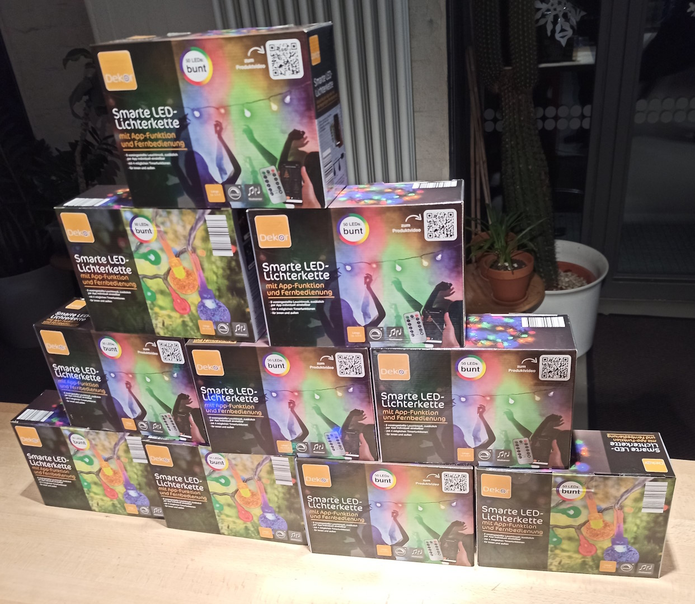
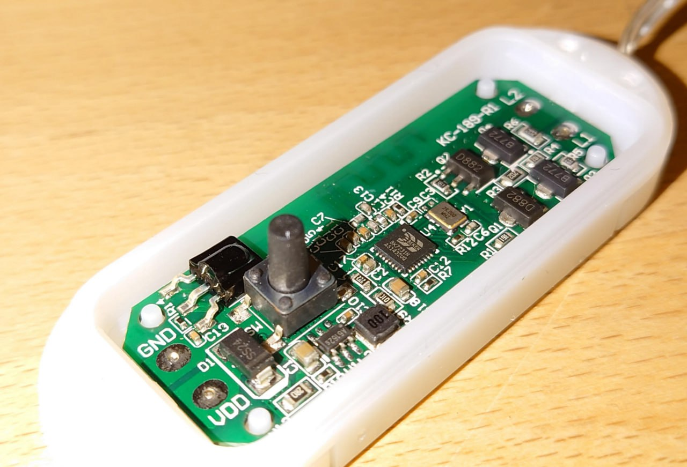
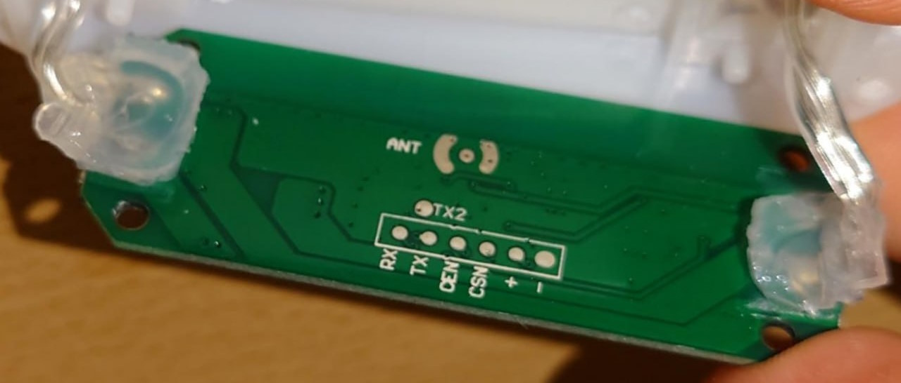
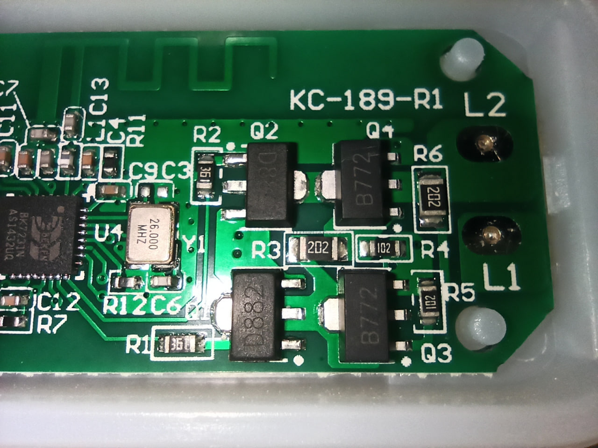
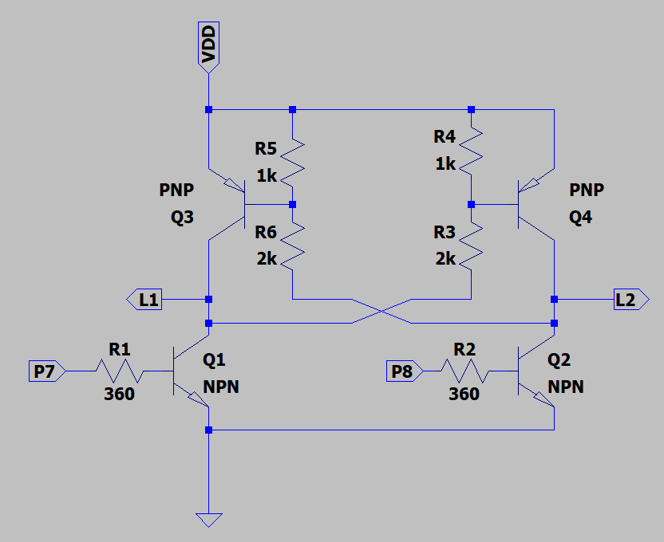

# tuya-ir-string-lights
Some information about cheap Tuya-based Wifi fairy lights with IR remote

- Branding: `Dekor Smarte LED-Lichterkette`
- EAN: `4311536003073`
- Imported by: `Light Trade GmbH` for `KOFUR Handelsgesellschaft mbH`
- Product video: http://lighttrade.net/kofur/smarte_lichterkette/
- Article number: `41958`
- Tuya Firmware version: `1.0.4`
- Tuya name: `IR8FunctionLightString`

## Software
Originally, this runs Tuya firmware for use with the "Smart Life" App, but an exploit in the original firmware can be used to upgrade to custom firmware without taking the controller apart.

### Tuya Cloudcutter
There is now a profile for [tuya-cloudcutter](https://github.com/tuya-cloudcutter/tuya-cloudcutter) called `1.0.4 - tiandu_bk7231n_light2_strip` to flash the firmware via WiFi.

IIRC, you run Cloudcutter, put the lights in pairing mode, wait until Cloudcutter saved the profile, then unplug and and plug it back in, then put the lights into pairing mode again, then the rest of the exploit/flashing will happen.

It makes sense to flash the ESPHome Kickstart firmware so the ESPHome image can be easily flashed in the next step

To get into Wifi pairing/AP mode:
- plug in the string
- hold the button for ~10 seconds until it flashes fast
- release and hold the button again for ~10 seconds until it flashes slow

### ESPHome

An ESPHome `fairylights.base.yaml` and example `fairylights-1.yaml` are provided in `/esphome/`. Currently, the lights themselves, the button and the IR receiver are implemented.

[@LeoDJ](https://github.com/LeoDJ) implemented a BK7231N-specific (a)synchronous PWM H-bridge component which is used here instead of the janky ESPHome [`hbridge` light component](https://esphome.io/components/light/hbridge) which is flickery and glitchy as it switches polarity in the ~60Hz ESPHome main loop.

## Hardware

- `BK7231N`
- button
- IR receiver
- two half-bridges
- UART pads for flashing

### Pins

- `P6`: Button (should be input with internal pullup)
- `P7`: Output stage L1
- `P8`: Output stage L2
- `P16`: IR receiver (should be input with internal pulldown)

### Output Stage

The output stage is basically just two half-bridges so the lights' polarity can be changed (to turn on the two colors).
However, it is designed in a weird way, which causes the transistors to short out the power supply when both outputs are active at the same time.

(part numbers match PCB silkscreen)
